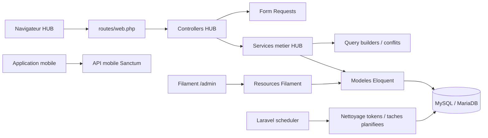
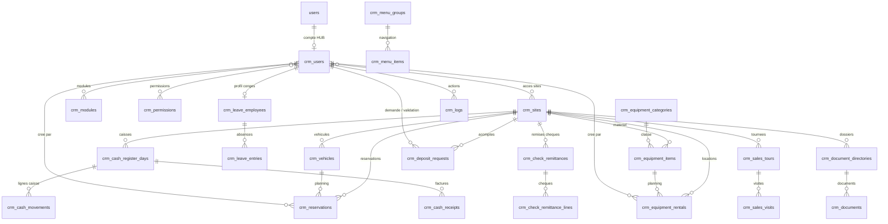
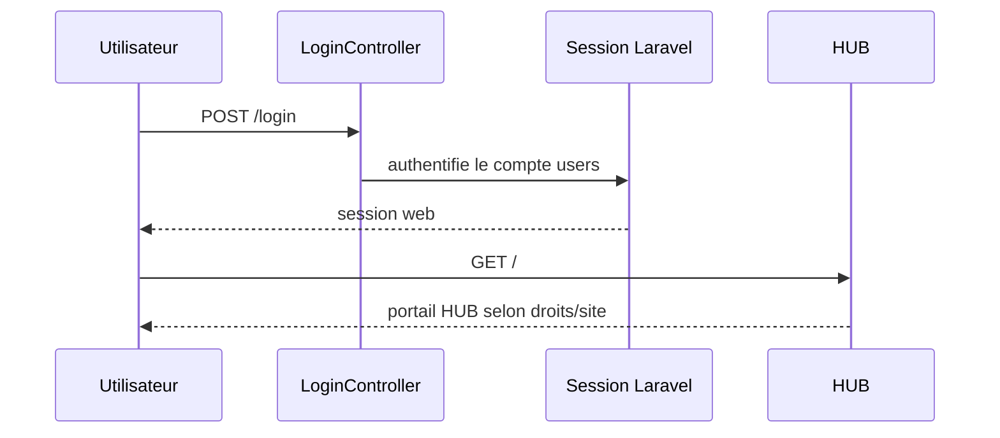
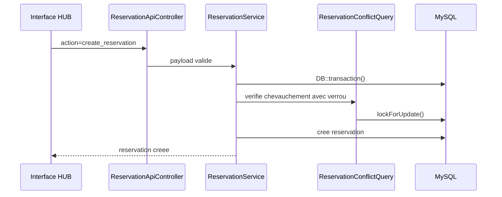
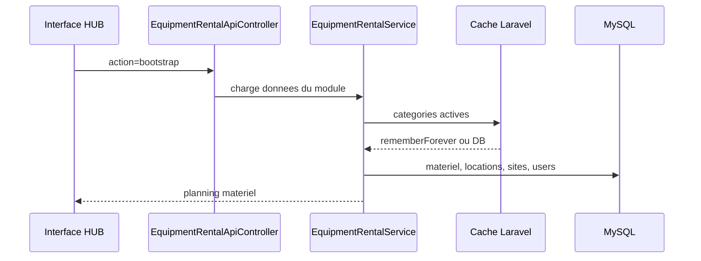
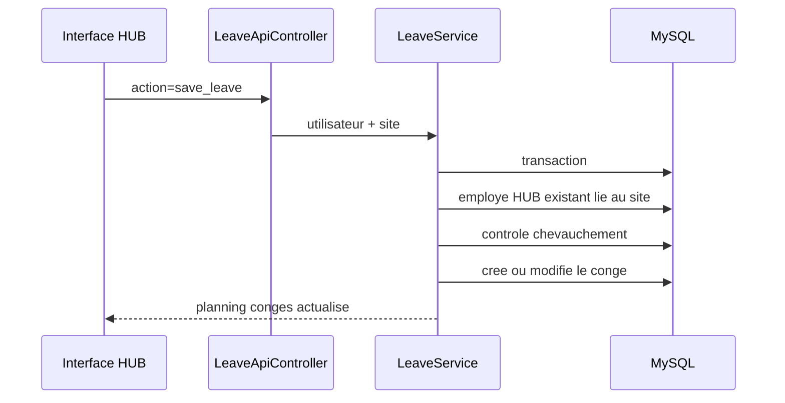
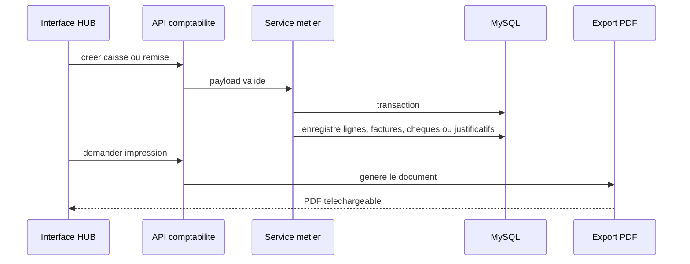
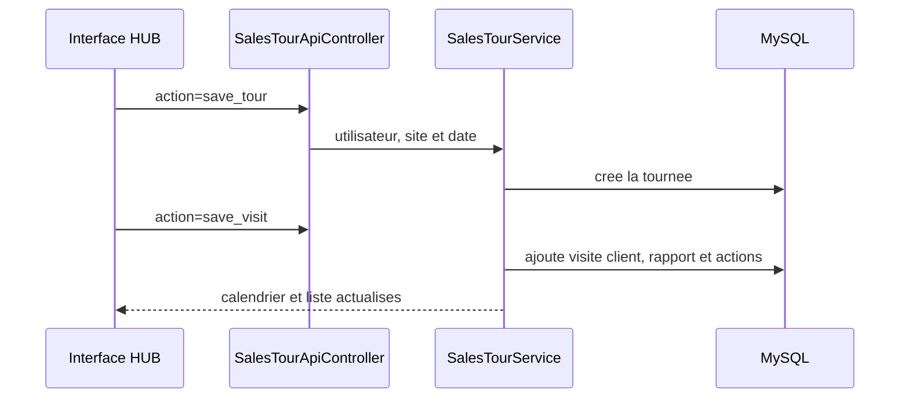

# Documentation technique HUB

Ce dossier regroupe la documentation technique du HUB Martin Sols : architecture,
schema de donnees, flux principaux, exploitation et deploiement.

## Architecture applicative



## Modules principaux

- Authentification web Laravel, avec comptes `users` et droits Spatie.
- Portail HUB React/Blade servi par les vues Laravel.
- Reservations vehicules avec controle de conflits.
- Locations de materiel avec categories, planning, demi-journee ou journee.
- Conges bases sur les utilisateurs HUB existants lies au site.
- Rapport de visite pour tournees commerciales, visites clients, comptes rendus et suivi des actions.
- Controle caisse avec encaissements, sorties, comptage especes, ecarts, justificatifs et PDF.
- Demandes d'acompte avec creation terrain et validation comptable.
- Remises de cheques avec photos, aide OCR, controles signature/destinataire et export PDF.
- Documents par site : Promo, Fiches techniques et Procedures.
- Tapis ROMUS integre pour saisir les mesures et generer les PDF.
- Pages HUB administrables.
- Administration Filament pour les donnees de reference et permissions.
- PWA installable via `manifest.json` et Service Worker.
- API mobile via Sanctum.
- Endpoints HUB exposes par Laravel sans extension `.php`.
- Creation admin par commande Artisan `crm:admin`, sans mot de passe stocke dans `.env.example`.

## Experience developpeur

- Standard modulaire : [HUB_MODULE_STANDARD.md](HUB_MODULE_STANDARD.md)
- Guide de creation d'un module : [MODULE_CREATION_GUIDE.md](MODULE_CREATION_GUIDE.md)
- Autorisations HUB : [HUB_AUTHORIZATION.md](HUB_AUTHORIZATION.md)
- Deploiement : [DEPLOYMENT.md](DEPLOYMENT.md)
- Migration des endpoints legacy : [LEGACY_API_MIGRATION.md](LEGACY_API_MIGRATION.md)

Commandes utiles :

```bash
make install
make hooks
make quality
make deploy-check
```

`make hooks` active `.githooks/pre-commit`, qui verifie Laravel Pint sur les fichiers PHP stages avant chaque commit.

## Licence

Le projet Martin Sols HUB est publie en source disponible. Le code peut etre
consulte, teste et etudie pour un usage personnel ou d'evaluation, mais tout
usage professionnel, commercial, client, production, hebergement, revente ou
redistribution demande l'accord ecrit prealable de Jean-Philippe DEGERT / JP2
Creation.

Voir [../LICENSE.md](../LICENSE.md).

## Schema ER simplifie



## Tables metier

- `crm_sites` : sites disponibles dans le HUB.
- `crm_users` : profil HUB relie au compte Laravel `users`.
- `crm_modules`, `crm_permissions` : activation des modules et droits fins.
- `crm_user_sites`, `crm_user_modules`, `crm_user_permissions` : pivots de droits HUB.
- `crm_vehicles`, `crm_reservations` : flotte et planning vehicules.
- `crm_equipment_categories`, `crm_equipment_items`, `crm_equipment_rentals` : materiel et locations.
- `crm_leave_employees`, `crm_leave_entries` : profils conges et absences.
- `crm_cash_register_days`, `crm_cash_movements`, `crm_cash_receipts` : controle caisse, lignes, factures et comptage.
- `crm_cash_receipt_archives`, `notification_logs` : archivage comptable et suivi des notifications.
- `crm_check_remittances`, `crm_check_remittance_lines` : remises de cheques, photos et montants.
- `crm_deposit_requests` : demandes d'acompte et validation.
- `crm_sales_tours`, `crm_sales_visits` : rapports de visite commerciaux et visites clients.
- `crm_document_directories`, `crm_documents` : bibliotheque documentaire par categorie et site.
- `crm_menu_groups`, `crm_menu_items` : structure du menu.
- `crm_pages` : pages internes administrables.
- `crm_logs` : journal metier des actions critiques, alimente par `CrmActivityLogger`.
- `personal_access_tokens` : tokens Sanctum mobile.

## Flux principaux

### Connexion web



### Reservation vehicule



### Location materiel



### Conges



### Controle caisse et remises de cheques



### Rapport de visite



## Assets, logs et cache

- Les assets servis depuis `public/assets` sont appeles avec `App\Support\CrmAsset`.
- Les assets de modules sont publies vers `public/modules` avec `php artisan crm:publish-module-assets --force`.
- La version d'asset est forcee par `CRM_ASSET_VERSION`, puis par `.deployed-revision` en deploiement, puis par `filemtime`.
- Les logs Laravel utilisent le canal `daily`, avec `LOG_DAILY_DAYS=30`.
- Le canal `horizon` est configure en `daily` sur `storage/logs/horizon.log`.
- Le cache applicatif utilise le store configure par `CACHE_STORE`.
- Les categories materiel actives sont mises en cache et invalidees lors des modifications.
- Les routes API HUB utilisent `CRM_API_THROTTLE_PER_MINUTE`; login web et token mobile utilisent `CRM_LOGIN_THROTTLE_PER_MINUTE`.
- Les reponses JSON API peuvent etre compressees en gzip via `CRM_RESPONSE_COMPRESSION_ENABLED`.
- Les sauvegardes SQL sont ecrites par `backup:run` en flux gzip, sans charger le dump complet en memoire PHP.
- En MySQL/MariaDB, `backup:run` utilise `mariadb-dump` ou `mysqldump`; en SQLite local, un export PHP streamable reste disponible pour les tests.
- Les sauvegardes peuvent etre envoyees vers un disque externe Laravel, par exemple S3, via `CRM_BACKUP_DISK`.
- Le developpement local peut utiliser Sail via `docker-compose.yml`.
- La CI GitHub lance Pint, le build Vite et les tests sur PHP 8.3.

## Scheduler

Le scheduler Laravel doit etre execute toutes les minutes par cron :

```cron
* * * * * cd /home/jpfronpi/crm/current && php artisan schedule:run >> /dev/null 2>&1
```

Taches actuellement planifiees :

- `sanctum:prune-expired --hours=24`, chaque jour a `02:15`.
- `backup:run --verify --quiet`, chaque jour a `02:30`.

Les sauvegardes locales par defaut sont conservees dans `storage/app/private/backups/database`.
La retention conserve par defaut 14 sauvegardes quotidiennes, 8 hebdomadaires et 12 mensuelles :

```dotenv
CRM_BACKUP_KEEP=14
CRM_BACKUP_KEEP_WEEKLY=8
CRM_BACKUP_KEEP_MONTHLY=12
CRM_BACKUP_TIMEOUT_SECONDS=0
```

Pour un stockage externe, configurer un disque S3 puis passer `CRM_BACKUP_DISK=s3` et un chemin dedie. Le fichier est compresse localement en flux, puis envoye au disque de destination via stream.

Pour chiffrer les archives :

```dotenv
CRM_BACKUP_ENCRYPT=true
CRM_BACKUP_ENCRYPTION_KEY="une-cle-longue-stockee-hors-git"
```

Le chiffrement utilise Sodium `secretstream` et produit des fichiers `.sql.gz.enc`. La verification `--verify` controle l'archive gzip avant chiffrement et envoi. Si une sauvegarde echoue, une alerte est enregistree dans `notification_logs` avec `template_key=backup.database.failed`.

Un test mensuel de restauration doit etre fait sur une base isolee, jamais sur la production. Le flux recommande est : telecharger la derniere archive externe, la dechiffrer si besoin, la decompresser, restaurer dans une base temporaire, puis verifier que `php artisan migrate:status` et quelques parcours critiques HUB passent sur cette base.

## Deploiement

Voir [DEPLOYMENT.md](DEPLOYMENT.md).

Commandes de controle apres deploiement :

```bash
php artisan migrate --force
php artisan optimize:clear
php artisan schedule:list
php artisan view:cache
php artisan view:clear
php artisan test
```

Quand le nombre de migrations deviendra trop couteux pour les environnements de test, generer un schema dump avec `php artisan schema:dump` depuis une base propre et versionner le fichier genere.

Les migrations metier sont versionnees dans `Modules/*/database/migrations`; seules les migrations globales Laravel et les migrations de packages restent dans `database/migrations`.

## Releases

Les releases doivent etre documentees dans `CHANGELOG.md` puis taguees dans Git.

Convention recommandee :

```bash
git tag -a vYYYY.MM.DD.N -m "Release vYYYY.MM.DD.N"
git push origin vYYYY.MM.DD.N
```

Ne pas creer de tag tant que les modifications de la release ne sont pas commitees.
